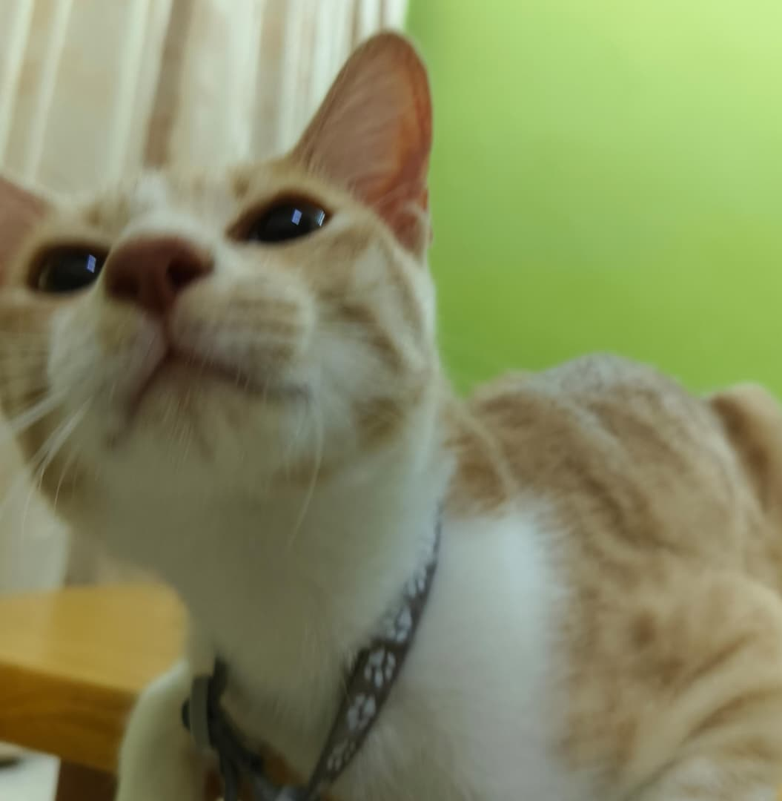

# ABOUT ME

Hi! I'm Tan Zec Vone, a third year Computer Science student, specialising in Software Engineering at Universiti Malaya. I'm interested in frontend and backend development, and enjoy coming up with creative solutions to real-world problems.

# EXPECTATION FOR WIF3005 SOFTWARE MAINTENANCE AND EVOLUTION
For this course, I hope to learn how to maintain existing software, understand and improve legacy code, and make changes to software without affecting its existing functionality. I also expect to gain practical experience with software maintenance techniques and better understand how software evolves over time to meet new requirements.

